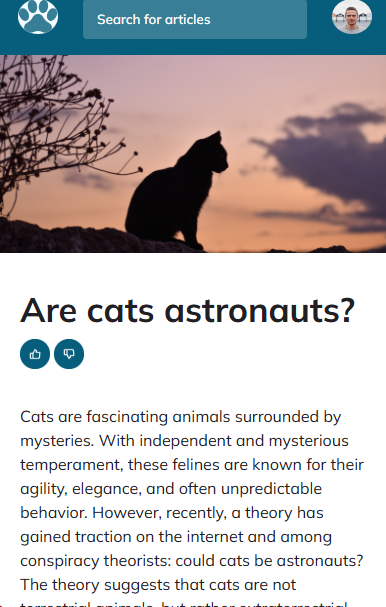

<h1 align="center">Cat Blog</h1>

Developed by Emerson William. 
UI/UX Layout by RocketSeat.

  <a href="#-technologies">Technologies</a>&nbsp;&nbsp;&nbsp;|&nbsp;&nbsp;&nbsp;
  <a href="#-project">Project</a>&nbsp;&nbsp;&nbsp;|&nbsp;&nbsp;&nbsp;
  <a href="#-layout">Layout</a>&nbsp;&nbsp;&nbsp;|&nbsp;&nbsp;&nbsp;
  <a href="#memo-license">License</a>

🔖 Pages

You can view and interact with the project page through

<a href="https://ivanbs14.github.io/Land_page_BlogGatos/">Click here</a>

  Desktop version: 
   
  Mobile version: 
  

 

## 🚀 Technologies

This project was developed with the following technologies:

- HTML
- CSS
- Mobile First
- Git and Github

## 💻 Project

Cat blog landing page.

## 🔖 Layout

The layout of the project was provided by

https://www.rocketseat.com.br/

## :memo: License

This project is under the MIT license.

---
